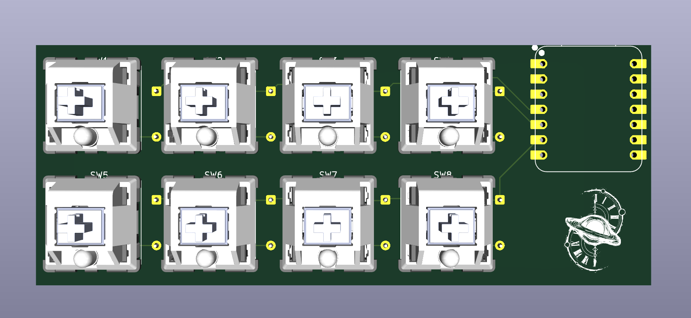
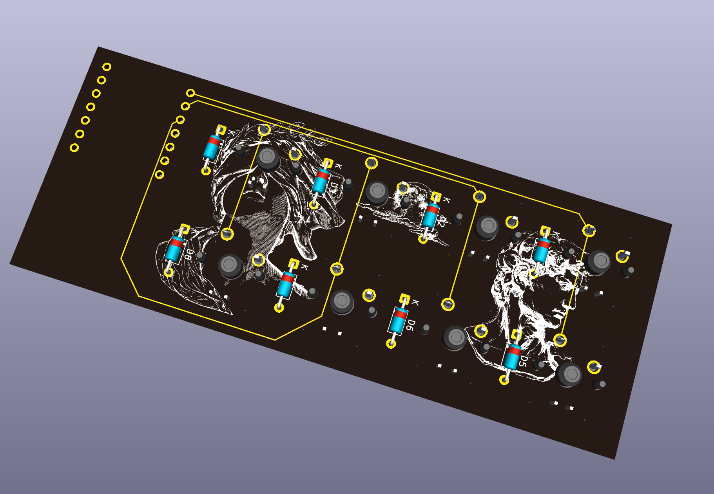
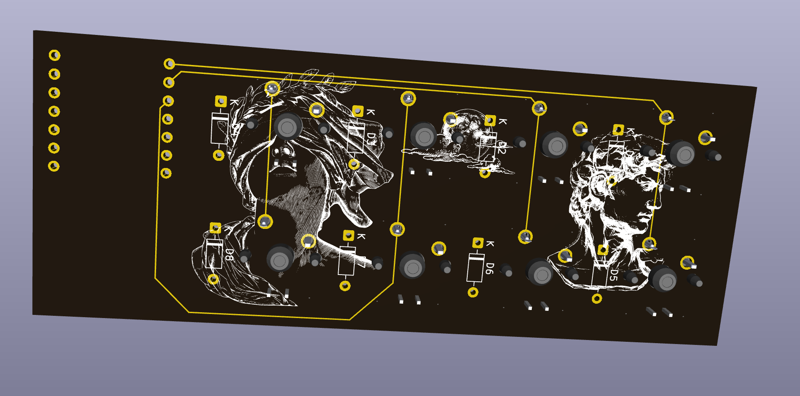

# Macropad

It is an 8 key macropad, which helps users control small tasks which are repetitive easily. like closing or opening new tabs, or  even opening a certain website with a click of a button. there are a few silkscreen images to enhance the visuals of this macropad.

## What's in here

- `macropad-pcb.kicad_pro` - KiCad project file
- `macropad-pcb.kicad_sch` - schematic
- `macropad-pcb.kicad_pcb` - board layout
- `image1.png`, `image2.png`, `image3.png` - board renders
- `image4.png` - pcb routing

## Preview

## Credits

Made by Rudransh Goel (stolen_username on slack)